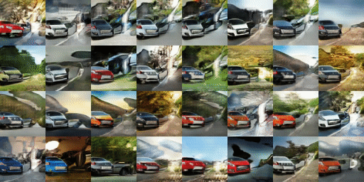

# BlockGAN

Code release for BlockGAN: Learning 3D Object-aware Scene Representations from Unlabelled Images

<p><table>
  <tr valign="top">
    <td width="50%"></td>
    <td width="50%"></td>
  </tr>
</table></p>


[BlockGAN: Learning 3D Object-aware Scene Representations from Unlabelled Images](https://www.monkeyoverflow.com/#/blockgan/)  
 [Thu Nguyen-Phuoc](https://monkeyoverflow.com/about/),  [Chrisian Richardt](https://richardt.name/), [Long Mai](https://mai-t-long.com/), [Yong-liang Yang](http://yongliangyang.net/), [Niloy Mitra](http://www0.cs.ucl.ac.uk/staff/n.mitra/index.html)    

## Dataset

Please contact Thu Nguyen-Phuoc for datasets.

## Training

- To run the training of BlockGAN

```	
python main.py ./config_synthetic.json --dataset Chair --input_fname_pattern ".png" 

python main.py ./config_real.json --dataset Car --input_fname_pattern ".jpg"
```
Help with config.json

```
image_path:
			Full path to the dataset directory.
gpu:
			Index number of the GPU to use. Default: 0.
batch_size:
			Batch size. Defaults is 32.
max_epochs:
			Number of epochs to train. Defaults is 50.
epoch_step:
			Number of epochs to train before starting to decrease the learning 			   rate. Default is 25.
z_dim:
			Dimension of the noise vector. Defaults is 90.
z_dim2:
			Dimension of the noise vector. Defaults is 30.			
d_eta:
			Learning rate of the discriminator.Default is 0.0001
g_eta:
			Learning rate of the generator.Default is 0.0001
reduce_eta:
			Reduce learning rate during training.Default is False
D_update:
			Number of updates for the Discriminator for every training 			        step.Default is 1.
G_update:
			Number of updates for the Generator for every training 			               step.Default is 2.
beta1:
			Beta 1 for the Adam optimiser. Default is 0.5
beta2:
			Beta 2 for the Adam optimiser. Default is 0.999
discriminator:
			Name of the discriminator to use. 
generator:
			Name of the generator to use. 
view_func:
			Name of the view sampling function to use.
skew_func:
			Name of the perspective skew function to use.
train_func:
			Name of the train function to use.
build_func:
			Name of the build function to use.
style_disc:
			Use Style discriminator. Useful for training images at 128.
sample_z:
			Distribution to sample the noise fector. Default is "uniform".
add_D_noise:
			Add noise to the input of the discriminator. Default is "false".
DStyle_lambda:
			Lambda for the style discriminator loss. Default is 1.0
lambda_latent:
			Lambda for the identity regulariser.Useful for training images at 			  128.Default is 0.0.
ele_low:
    		Default is 70.
ele_high:
			Default is 110.
azi_low:
			Default is 0.
azi_high:
			Default is 360.
scale_low:
			Default is 1.0
scale_high:
			Default is 1.0
x_low:
			Default is 0.
x_high:
			Default is 0.
y_low:
			Default is 0.
y_high:
			Default is 0.
z_low:
			Default is 0.
z_high:
			Default is 0.
with_translation:
			To use translation in 3D transformation. Default is "true".
with_scale:
			To use scaling in 3D transformation. Default is "true".
focal_length:
			Camera parameter. Default is 35.
sensor_size:
			Camera parameter. Default is 32.
camera_dist:
			Camera distance. Default is 11.
new_size:
			Voxel grid size. Default is 16.	
size:
			Voxel grid size. Default is 16.	
output_dir: 
			Full path to the output directory.
```

## Citation

If you use this code for your research, please cite our paper

```
@inproceedings{BlockGAN2020,
  title={ BlockGAN: Learning 3D Object-aware Scene Representations from Unlabelled Images  },
  author={Nguyen-Phuoc, Thu and Richardt, Christian and Mai, Long and Yang, Yong-Liang and Mitra, Niloy},
  booktitle =  {Advances in Neural Information Processing Systems 33},
 month = {Nov},
 year = {2020}
}
```